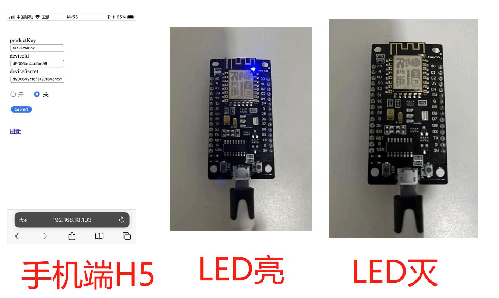

# 简单的Iot服务器程序(Netty)和ESP8266程序(Arduino)，可以用手机通过WiFi控制一个LED灯。

1、服务器端由Spingboot+Netty构成；

2、硬件是ESP8266开发板；（常见的那种，见下面的图）

3、由于是简单的演示，所以App啥的就不做了，仅在网页端控制；

功能：

​		手机端可以开关设备上的LED灯，设备上按键开关LED后，手机端可以显示LED的开关状态。

使用方式：

​		1、用IDEA打开源码，运行；

​		2、用Arduino编辑器打开ESP8266程序，修改局域网IP为电脑IP，然后烧录；

​		3、浏览器输入 http://<电脑局域网IP地址>:8080/set/led ，就可以控制设备LED灯的开关了。

演示视频：

https://youtube.com/shorts/TMbjdpVQZuE?feature=share

效果图：

这个板子，网上随便买，价格20多块。

这份源码，不建议商用。仅供新手学习使用。（因为没有TLS加密，是裸奔的）

适当修改一下，加上TLS传输层加密、ACL身份验证、Qos机制、消息队列、时序数据库、独立API端和管理后台，然后进行集群化部署，就可以商用了。

我手上有此份源码的TLS加密版本，如有兴趣，请联系我 ：）。微信：soyojoearth
